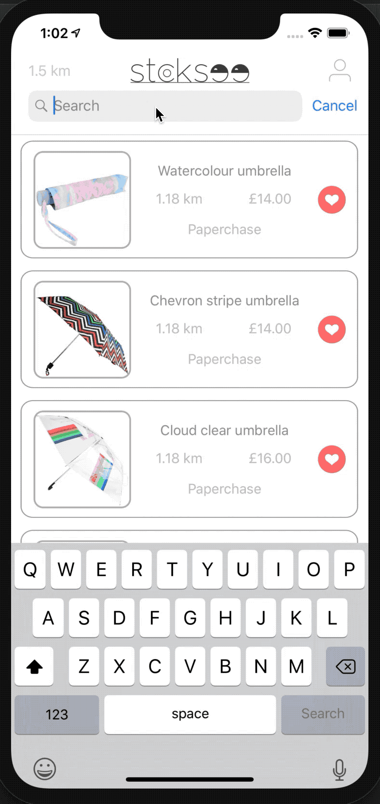

# Stocksee

## Search the shelves of nearby shops

Stocksee was a business that I started after being tired of searching shops on the highstreet for products that I wanted to buy right now. A product search on Google takes a few seconds, but trying to find the same product sold by a nearby retailer could take you hours. We live in the 21st century and the retail experience needed modernising, so I built Stocksee. 

Stocksee is a tech solution, with a consumer facing app that allows users to search the shelves of local retailers, whilst providing retailers with consumer insights relevant to their customer demographic using cutting-edge analytics. I built the entire platform myself, as well as undertaking everything that a business needs to grow; sales, marketing, investment etc). All graphic design work, animations, UI and UX was also done solely by me. Some of the technologies I used included:

* Custom Analytics
* Firebase
* Algolia
* Mapbox
* IGListKit
* Crash Reporting
* Remote Configuration
* Remote Data Storage
* Cloud Functions
* Diffing Algorithms
* Network Management
* Custom Animations
* OAuth Login

The app was released in London, and I managed to grow it to over 600 retail locations across the city!  

## Intro and Signup

The Intro and Signup was designed to be fluid and intuitive, as well as abiding by the new GDPR laws. 

## Filters and Complex Search

Custom complex search was built using filters, allowing users to refine their search.

## Searching for and Locating Products

Users were able to search for products that they wanted. By managing caching and querying, a fast and responsive search experience was provided. I implemented a custom gesture that allowed users to change their search radius by pinching their screen.

## Map and Product Details

Once the user had found the product that they were looking, they were provided with directions to the shop that stocked it. This was achieved by overlaying a live map with real-time directions. As a result, the directions updated as the user travelled towards the shop

